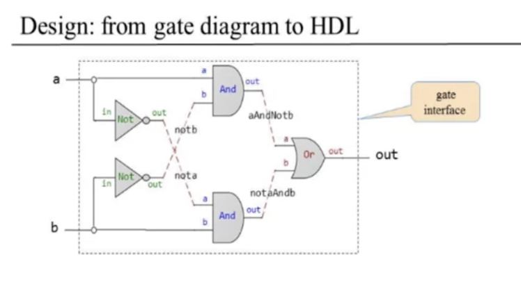
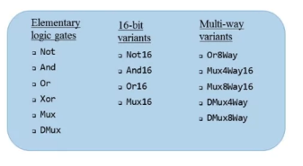
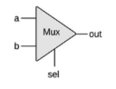
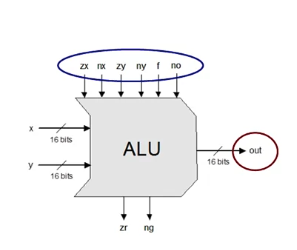
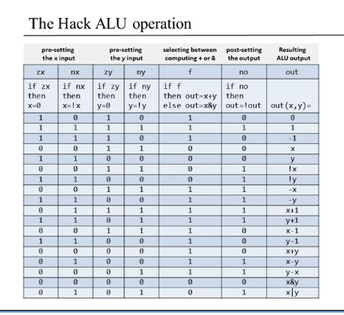
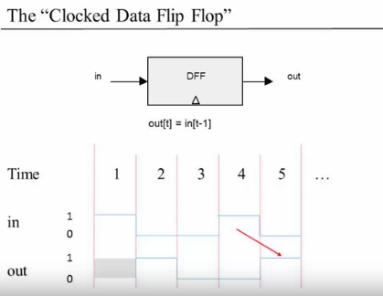
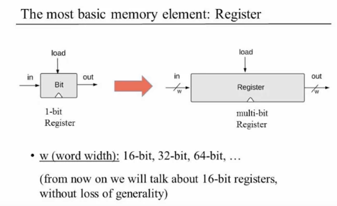
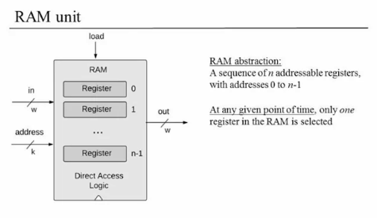
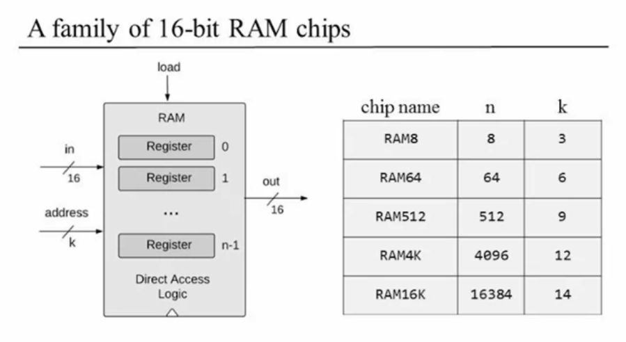
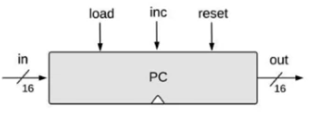

# Unit 1.4 Hardware Descrive Language

- interface と implementation の分離
  - interface: ユーザ目線(signature/APIがわかる)
  - implementation: 設計者目線

## Xorを作る

- connectionに名前をつける
  
- チップごとにゲート図を書く
- チップごとに、そのチップとそのすべての接続を記述するHDLステートメントを1つ記述する

```hdl
CHIP Xor {
    IN a, b;
    OUT out;

    PARTS:
    Not (in=a, out=nota);
    Not (in=b, out=notb);
    And (a=a, b=notb, out=aAndNotb);
    And (a=nota, b=b, out=notaAndb);
    Or  (a=aAndNotb, b=notaAndb, out=out);
}
```

## HDLはfunctional関数型(declarative宣言型)である

- 手続きは行われていない。プログラムの実行も行われていない。
- ゲートダイアグラムの静的な記述に過ぎない。
- この記述はインタプリタが受け取って実行をする。実行するものはHDLの外側にいる。
- HDLステートメントは好きな順序で記述できるけど、通例的に左から右に書いたほうがいいよ。

## HDLの種類

- VHDL, Verilogが多い

# Unit 1.5 Hardware Simulation

- シミュレータにテストスクリプトをロードすることで自動テストを繰り返し実行できる。

## 実際のテスト

- 実際のテストでは、出力を見て「うまくいった」とは言えない。
- ALU, CPU等のチップはXorよりもっともっと複雑だから。
- もっと体系的に・機械的にやらなければいけない！

## ハードウェア構築プロジェクト

- 登場人物
  - システムアーキテクト
    - チップ全体の望ましい動きを定義
    - API, test, compareを作る
  - 開発者
    - それらをベースにHDLを作る

# Unit 1.6 Multi-bit Buses

- 複数のビットをまとめて処理したい。1つのエンティティとして扱いたい。
- 以下のようにすると、16ビットごとで扱える

```hdl
CHIP Add16 {
    IN a[16], b[16];
    OUT out[16];

    PARTS:
        // ...
}
```

## バスをサブバスに分割する

```hdl
    ...
    IN lsb[8], msb[8], ...
    ...
    Add16(a[0..7]=lsb, a[8..15]=msb, b=..., out=...);
    Add16(..., out[0..3]=t1, out[4..15]=t2);
```

# Unit 1.7 Project 1 Overview

- Given: Nand
- Goal
  - Not
  - And
  - Or
  - Xor
  - Mux
  - ...
- Project1で作ったのが今後の土台になる。
- 

## Multiplexor(Mux)



```
if (sel==0)
  out=a
else
  out=b
```

## Demultiplexor(Dmux)

- Distributorみたいなイメージ
- Muxの逆向きの図

## MuxとDMux

- 1本の回線で複数のメッセージをお売りたい
  - オシレータ
- 1本の回線で複数のメッセージを送れる。selはルールみたいなもん
- エンコードとデコードは完全非同期にできる。

## Mux4way16

- 入力が4way、すべて16bit
- selは2bit必要

## その他

- Multi-bit bussesでは、A[0]は一番右の値（最下位ビット, LSB）、A[15]は一番左の値（最上位ビット, MSB）。

# Unit 1.8 Perspective

- NAND以外から始めることは可能？→YES
  - NORで作るとかANDで作るのも可能。
- ではなぜNAND？
  - 安くて安全だから。
- NANdを作らなければいけないとしたら？
  - NANDゲートのNMOS実装
  - どっちかというと物理学、電子回路の世界。
    
- 我々が気にするのは「どのように実装されているか」ではなく。インターフェース。
  - →受講者を置いてけぼりにしたあとに「気にしなくていいよ」っていうのはすごく鮮やかだった。

# Unit 2.1 Binary Numbers

# Unit 2.2 Binary Addition

1. 半加算器 Half Adder
   IN: a, b
   OUT: sum, carry
2. 全加算器 Full Adder
   IN: a, b, c
   OUT: sum, carry
3. 加算器 Adder
   IN: a[16], b[16]
   OUT: out[16]

# Unit 2.3 Negative Number

- 最上位ビットをマイナスと表現してもよいが、計算上不都合が起きる
- `-x` という値を表現したいなら、 `2^n - x` を使用する (2の歩数表現)
  - 1001 = 10000 - 0111 = -7(10)
  - 1111 = 10000 - 0001 = -1(10)
- 14(1110) + 13(1101) = 27(11011) → 11(1011)
  - つまり最上位ビット(n)から溢れた桁を除く = 2^n の剰余を求める
- 符号反転器をつくる
  - Neg(x) := xを受け取り-xを返す
    - IN: in
    - OUT: out
  - `x + (-x) = 2^n`
  - `-x = 2^n - x = 1 + (2^n - 1) - x = 1 + NotN(x) = IncN(NotN(x))`

# Unit 2.4 Arithmetic Logic Unit (ALU)

- Von Neumann Architecture

  - 重要なのはCPUとALU
  - input1, input2, 関数f を入力として受け取り、 f(input1, input2) を返す
  - fは算術関数、論理関数(And, Or等)どちらもある
  - ポイントは「どこまでをハードウェアで実装するか？」で、ハードウェアで実装しないことを決めてもあとからソフトウェアで補強することができる
    - 乗算、除算をALU煮含めない場合でも、ソフトウェア側でいくらでも実装できる
      
- input

  - if zx then x=0
  - if nx then x=!x
    - zx && nx なら、 x=1111111111111111 となる
  - if zy then y=0
  - if zy then y=!y
  - if f then out=x+y else out=x&y
  - if no then out=!out
- output

  - if out==0 then zr=1 else zr=0
  - if out<0 then ng=1, else ng=0

## まとめ



if out==0 then zr=1 else zr=0
if out<0 then ng=1, else ng=0

- ALUは
  - Simple
  - Elegant
  - Easy to implement
    - 16bit値を0000000000000000に設定する
    - 16bit値を反転させる
    - 2つの16bit値を計算(+/&)する

# Unit 2.6 Perspective

- このコースではALUだけが少し簡略化されている。ほかのチップはすべて標準。
- 乗算、除算を使用できるALUも作れる。

  - 各レイヤーにどれだけの機能を入れるかは設計者が決められる。
  - 今回のコースでは、乗算・除算をソフトレイヤーにまかせている
  - ソフトウェアプログラマレイヤーでは全く気にならない。
  - ハードウェアで複雑な計算も実装すると、計算は高速になるが設計・実装コストが嵩む。とれーどおふでしかない
- 加算器に問題がある（Adder）

  - 全加算器を複数並べて実現しているので、各ゲートで非同期処理できていない→
    - 各コンデンサに電荷が伝播するまでに遅延が生じている。
    - 先に全キャリーを計算することで低遅延な加算器を作ることができる（carry look ahead）

# Unit 3.1 Sequential Logic

- Clockの概念を導入する

  - 電流レベルでは0-1で変化しない。緩やかに変化する。
  - それをデジタル（0-1）で評価するために、クロック単位で時間を区切る(離散時間)。
  - 厳密には、クロックサイクルの終わりの時点での電荷の状態でシステム的な0-1を評価している
- Combinatorial Logic vs Sequential Logic

  - Combinatiorial: out[t] = function(in[t])
  - Sequential: out[t] = function(in[t-1])

# Unit 3.2 Flip Flops

- Sequentialロジックを実現するために、2つの単位時間をまたぐ = 状態を記憶するユニットが必要

## Clocked Data Flip Flop (Clocked DFF)

- out[t] = in[t-1]

  - △マークは「時間に依存したチップである」ことを表現
    
- 1-bit Register

  - if load(t-1) then out(t)=in(t-1)
  - else out(t)=out(t-1)

# Unit 3.3 Memory Unit

- Main Memory: RAM, ...
- Secondary Memory: Disks, ...
- Volatile / non-volatile (揮発性/不揮発性)
- このユニットでは揮発性のRAMについて扱う

## RAM



- w (word width): 16-bit, 32-bit, 64-bit, ...

  - これはレジスタが扱うデータのビット数を表している
  - 今回は16-bitコンピュータを作る
- レジスタの状態を扱う。

  - レジスタ内に格納されている値（内部回路が現在表現している値）のこと
- read

  - outを読むだけでOK
- write

  - set in = v
  - set load = 1
  - とすると、次clockからoutもvとなる

## RAM Unit



- RAMをn個組み合わせたユニット
- 抽象化してかなりわかりやすくしている
  - レジスタが100万個あったとしても実際に操作されるレジスタはaddressで指定した1レジスタだけ。
  - 7つめのレジスタを指定するなら、 0111 をaddressに指定する
  - n個のレジスタを持つRAMユニットに対して必要なaddressのビット数は log n

### 操作

- read
  - set address = i
  - Register_i に保持されているデータが out に出力される
- write
  - set address = i
  - set in = v
  - set load = 1
  - Register_i 二保持されているデータが v に変わる
  - 次Clockからoutはvに変わる

## 16-bit RAMチップ



- RAM = Random Access Memory
  - この厚生内の任意のレジスタをランダムに選択して、同じアクセス時間でそのレジスタを読み書きできるという能力を表現

# Unit 3.4 Counters

- PC(Pogram Counter)
  - Reset: PC=0
  - Next: PC++
  - Goto: PC=n



# 3.5 Project3 Overview

- Given:
  - All the chips built in Projects 1 and 2
  - Data Flip-Flop (DFF Gate)
- Goal: BUild the following chips:
  - Bit
  - Register
  - RAM8
  - RAM64
  - RAM512
  - RAM4K
  - RAM16K
  - PC
